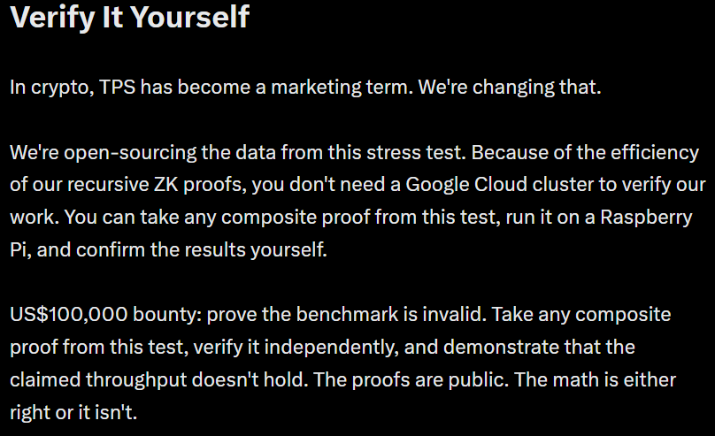
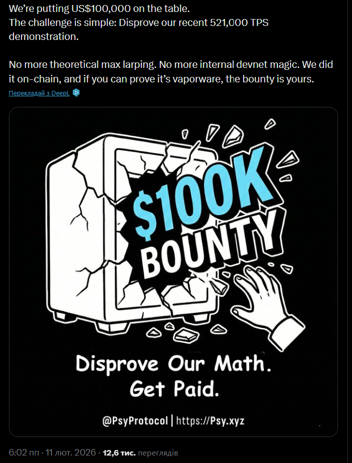

# Psy Protocol 521k TPS: Independent Reproducibility Assessment

**Assessment date:** August 2026

### Primary sources:
*   **Psy Protocol benchmark announcement (521k TPS):** [https://x.com/PsyProtocol/article/2019547399312797864](https://x.com/PsyProtocol/article/2019547399312797864)
*   **Psy Protocol $100,000 bounty announcement:** [https://x.com/PsyProtocol/status/2021615736238796967](https://x.com/PsyProtocol/status/2021615736238796967)
*   **Public benchmark explorer:** [https://st8.psy.xyz/explorer](https://st8.psy.xyz/explorer)
*   **Public Discord responses:** [https://x.com/Sergey007S/status/2035261873919041942?s=20](https://x.com/Sergey007S/status/2035261873919041942?s=20)
*   **Public X/Twitter discussions:** [https://x.com/Sergey007S/status/2067236675911053626?s=20](https://x.com/Sergey007S/status/2067236675911053626?s=20)
*   **Public bounty submission timeline:** [https://x.com/Sergey007S/status/2046176515323273365?s=20](https://x.com/Sergey007S/status/2046176515323273365?s=20)

---

## Executive Summary
Psy Protocol promotes a benchmark of approximately 521k TPS and describes the result as verifiable by anyone, with a $100,000 bounty attached to the claim.
I attempted to independently verify the benchmark using the information and artifacts publicly available from Psy Protocol.
I was able to inspect the published benchmark claims, explorer data, proof-related interfaces, and the publicly described verification flow.
I could not independently reproduce the 521k TPS result from the publicly available artifacts.
This is not a claim that the benchmark was fabricated.
It is not a claim that Psy's cryptographic proofs are invalid.
The finding is narrower:
**The published 521k TPS result is not currently independently reproducible from the public verification surface.**
That distinction matters because a proof that a particular computation or state transition is valid is not automatically a reproducible proof that the reported benchmark represents the performance of the system.

---

## 1. The Claim
Psy Protocol publicly presented a benchmark of approximately 521k TPS and described the benchmark as verifiable.
The project also publicly offered a $100,000 bounty connected to disproving or challenging the benchmark.
The verification standard therefore cannot reasonably be reduced to:
“The benchmark exists on the explorer.”
The relevant question is:
**Can an independent third party reproduce and test the benchmark using the published artifacts, without relying on Psy's internal environment or interpretation?**
That is the standard I attempted to apply.

*Psy Protocol public statement: independent verification + US$100,000 bounty*

*Official $100,000 bounty announcement tied to the 521,000 TPS demonstration*

---

## 2. What Was Independently Testable
The public surface exposes benchmark-related information, including the reported TPS result and block-level data. The explorer also exposes proof-related information and a verification flow. This is useful evidence.
However, it does not by itself provide the complete experimental state required to reproduce a benchmark. During the investigation, the practical verification path led to a selected block rather than a complete reproducible benchmark dataset. Psy's own communication also described the block used for the benchmark as a representative block.

*Psy Discord response regarding the representative benchmark block.*

Public visibility of benchmark-related artifacts is not equivalent to benchmark reproducibility. A verifier may be able to inspect a selected benchmark block, proof-related interfaces, or benchmark statistics. That does not automatically provide the complete experimental state required to independently reproduce the reported benchmark result.
That distinction is central. A selected block can demonstrate that a particular recorded state or transition exists. It does not, by itself, establish that the reported TPS is representative of the workload or system performance that produced it.

---

## 3. The Reproducibility Gap
For a high-throughput benchmark to be independently reproducible, an external researcher needs enough information to reconstruct the experiment.
At minimum, this means being able to establish:
* the benchmark dataset;
* the workload and transaction distribution;
* the criteria used to select the reported block;
* the relevant code and exact revision;
* the execution environment;
* the hardware configuration;
* the measurement procedure;
* the method used to derive the reported TPS figure.

The investigation identified a gap between the headline benchmark and this complete experimental state.
The specific missing elements requested during the investigation included:
* the full benchmark dataset;
* TPS distribution statistics;
* measurable criteria showing why the selected block was representative.

*Public finding (March 21, 2026): no clear path for an external observer to independently reconstruct the benchmark end-to-end.*

*Public finding (March 24, 2026): the 521k TPS figure is based on a single selected block, with no published full dataset or distribution statistics.*

The issue is therefore not simply “more documentation would be nice.”
The issue is that the experimental state needed to reproduce the headline number is not publicly reconstructible from the available verification surface.

---

## 4. Proof Is Not the Same as Benchmark Reproducibility
This is the most important technical distinction in this assessment.
A cryptographic proof can establish that a particular statement or computation satisfies the conditions encoded by the proof system.
That is valuable.
But a benchmark makes a broader claim.
A claim such as:
521k TPS
contains an implicit experimental statement about workload, execution conditions, measurement and representativeness.
A proof attached to one selected state transition does not automatically prove:
“This block is representative of the system's general throughput.”
Those are different claims.
The first can be cryptographically verified.
The second requires reproducible benchmark methodology and evidence.
This is why proof-backed and reproducible should not be treated as synonymous.

---

## 5. The Representative-Block Problem
The use of a representative block creates a specific verification question:
What makes this block representative?
If an entire benchmark consists of a large workload but the public verification surface exposes only one selected block, an independent researcher cannot determine whether that block is statistically representative without access to the underlying distribution.

 **Key Observation**
 The public verification surface exposes a selected benchmark block.
 The benchmark claim however refers to system throughput.
 Those are not equivalent claims.

For example, an external verifier would need to understand:
* how many blocks were produced;
* the TPS distribution across those blocks;
* whether the selected block was typical or exceptional;
* the workload distribution;
* whether warm-up or initialization periods were excluded;
* how outliers were handled;
* how the final TPS number was calculated.

Without those artifacts, independently reproducing the selection and measurement process is not possible.
This is the central gap identified in the investigation.

---

## 6. What Was Requested
The request was deliberately narrow.
The goal was not to demand proprietary information.
The request was:
Provide a practical way for an external party to independently verify the benchmark, or release the missing information required to reproduce it.
The requested artifacts included:
1. Full benchmark dataset.
2. TPS distribution statistics.
3. Criteria demonstrating why the selected block was representative.
4. A reproducible verification workflow.
A formal bounty claim and technical assessment were submitted based on Psy Protocol's own published benchmark materials, public statements, public responses and publicly accessible data.

*Formal public bounty claim (April 20, 2026): structured assessment submitted under Psy Protocol’s published “verifiable by anyone” bounty terms.*

---

## 7. What Happened After the Claim
The technical question was not resolved through a public reproducibility review.
The investigation included direct follow-ups and outreach to parties connected with the project and its ecosystem.

### Timeline
* **March 4, 2026** — Initial public verification review
* **March 21, 2026** — Reproducibility concern raised publicly
* **March 24, 2026** — Representative / selected-block issue documented
* **April 20, 2026** — Formal bounty claim submitted
* **April–June 2026** — Public follow-ups and outreach to team / investors
* **June 2026** — Full public timeline documented
* **August 2026** — No public reproducibility review or claim resolution identified

The record includes outreach to Psy Protocol as well as investors and related parties.
The important point is not the number of messages sent.
The important point is that the formal technical question remained unresolved:
* no public technical rebuttal addressing the reproducibility gap;
* no public reproducibility review;
* no public explanation establishing why the bounty claim was invalid;
* no public resolution of the claim.
The benchmark and bounty continued to be publicly promoted while the verification issue remained open.

---

## 8. What This Assessment Does Not Claim
This assessment does not claim:
* that the 521k TPS benchmark was fabricated;
* that Psy's cryptographic proofs are invalid;
* that the underlying system cannot reach high throughput;
* that the benchmark is mathematically impossible.
Those would require evidence that is not established here.
The claim made here is narrower and testable:
**An independent third party cannot currently reproduce and validate the published 521k TPS benchmark from the public artifacts available for verification.**
That is a reproducibility finding, not a claim of fraud.

---

## 9. Why This Matters
“Verifiable by anyone” is itself a technical property.
It should not mean:
“The project has published something that an interested researcher can inspect.”
It should mean:
**An independent researcher can obtain the necessary artifacts, execute the verification process, and reach the same conclusion without relying on the project's private environment or interpretation.**
That is the difference between visibility and reproducibility.
An explorer can expose the result.
A proof can establish the validity of a specific computation.
But independent reproducibility requires enough public information to reconstruct the experiment that produced the result.

---

## 10. Current Finding
Based on the public evidence reviewed:

| Property | Finding |
| :--- | :--- |
| 521k TPS headline | Public |
| Benchmark-related block data | Public |
| Proof-related interfaces | Public |
| Selected benchmark block | Publicly referenced |
| Full benchmark dataset required for reproduction | Not identified |
| TPS distribution required to assess representativeness | Not identified |
| Public criteria establishing representativeness | Not identified |
| Complete independent reproduction workflow | Not identified |
| Formal bounty claim | Submitted |
| Public resolution of the reproducibility issue | Not identified |

The conclusion is therefore:
**The 521k TPS result remains a public benchmark claim, but not an independently reproducible benchmark from the currently available public verification surface.**

---

## 11. The Standard
This case illustrates a broader principle for high-performance blockchain benchmarks:
**A benchmark does not become independently reproducible simply because its result, proof, or benchmark statistics are publicly visible.**
For a result to be independently reproducible, the public artifacts must allow an external party to reconstruct the experiment, not merely inspect its output.
A practical reproducibility package should allow a third party to answer:
1. What exactly was executed?
2. With which code revision?
3. Against which dataset?
4. On what hardware?
5. Under which configuration?
6. How was throughput measured?
7. Why was this result representative?
8. Can another researcher run the same experiment and obtain comparable results?
Until those questions can be answered from public artifacts, the benchmark remains a trust-dependent claim, regardless of how prominently the headline number or proof is displayed.

---

## Conclusion
The core issue is not whether Psy Protocol published data.
They did.
The issue is whether the published material is sufficient for an independent researcher to reproduce the 521k TPS benchmark itself.
At the time of this assessment, it is not.
The benchmark remains promoted as independently verifiable.
The $100,000 bounty remains associated with that claim.
The formal reproducibility challenge remains unresolved.
The appropriate next step is not another marketing statement.
It is the publication of the missing reproducibility artifacts and an independently executable verification path.

**Visibility is not reproducibility.**
**A proof is not automatically a benchmark.**
**And “verifiable by anyone” should mean exactly that.**

 This assessment can be invalidated.
 The required condition is simple:
 **Publish enough information for an independent third party to reproduce the benchmark and obtain comparable results.**
 Until then, the benchmark remains publicly visible but not independently reproducible.

---
**OxSergey Research**  
*August 2026*
